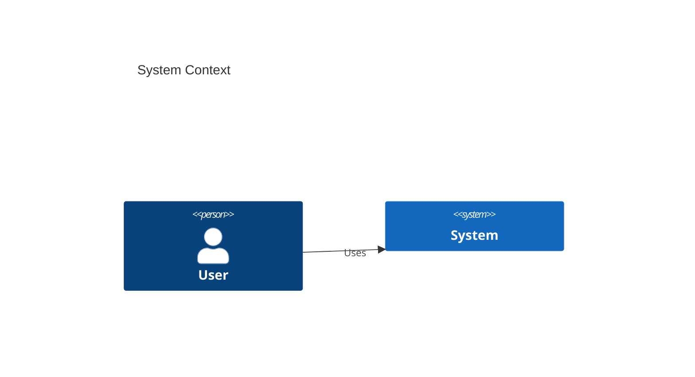
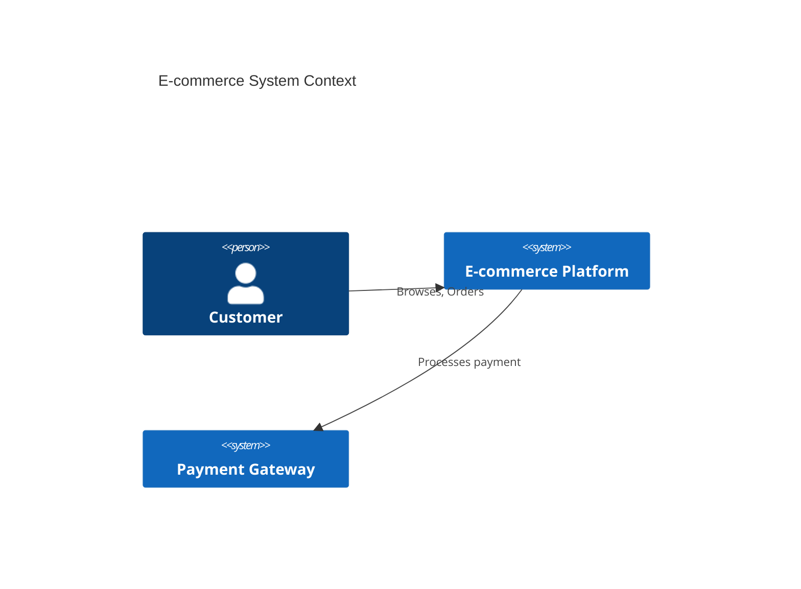
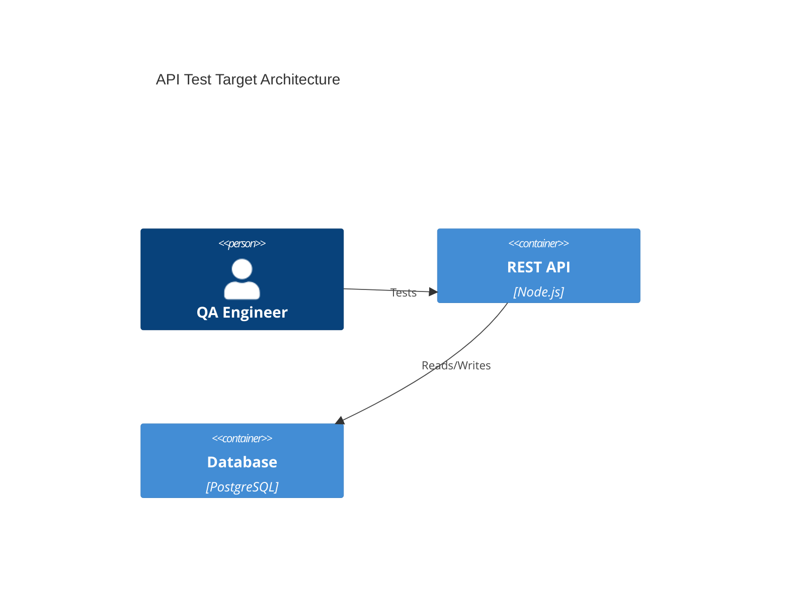
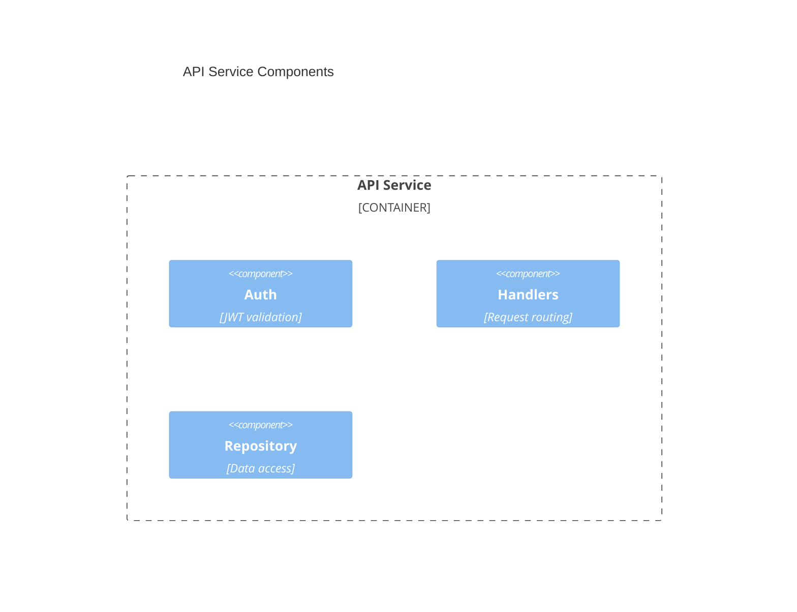

# Mermaid C4 Model Syntax

## Overview
C4 diagrams show system architecture at Context, Container, and Component levels. Mermaid supports C4 via `C4Context`, `C4Container`, `C4Component` blocks.

## Syntax

## QA Examples

### System Context

### Container Diagram

### Component View

## When to Use
- Test scope definition (what to test)
- Integration test planning
- Understanding system boundaries for E2E coverage
