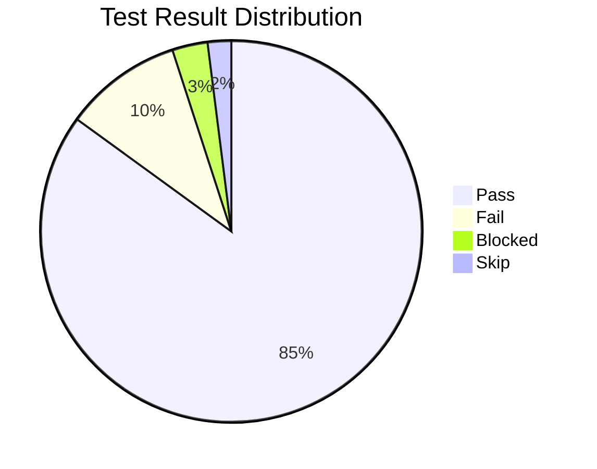
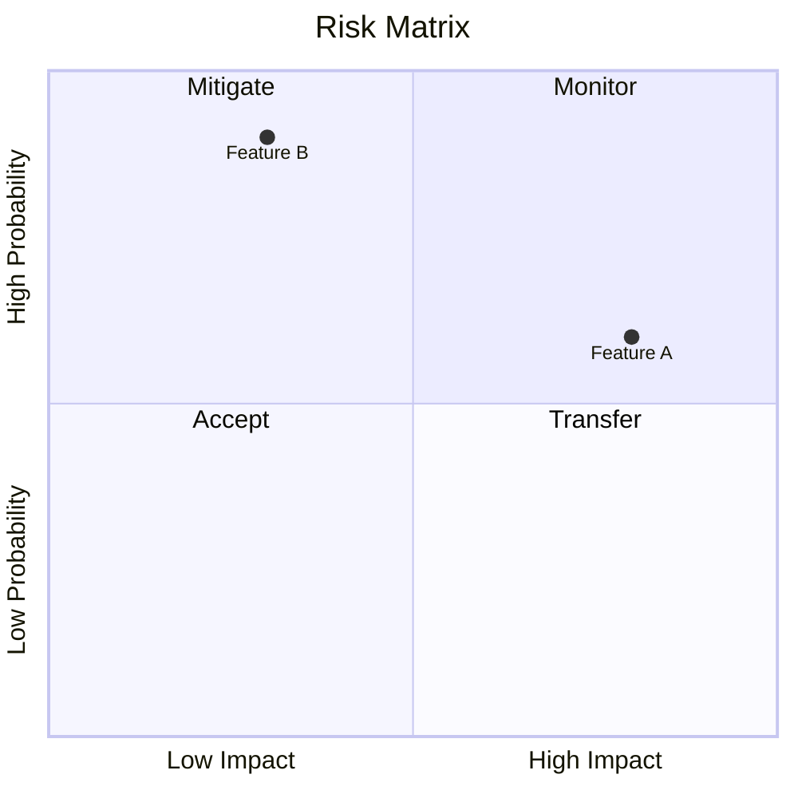
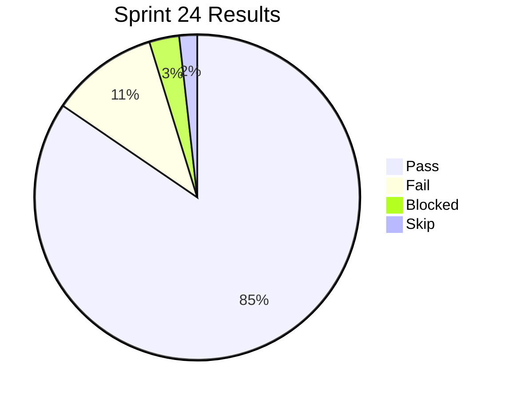
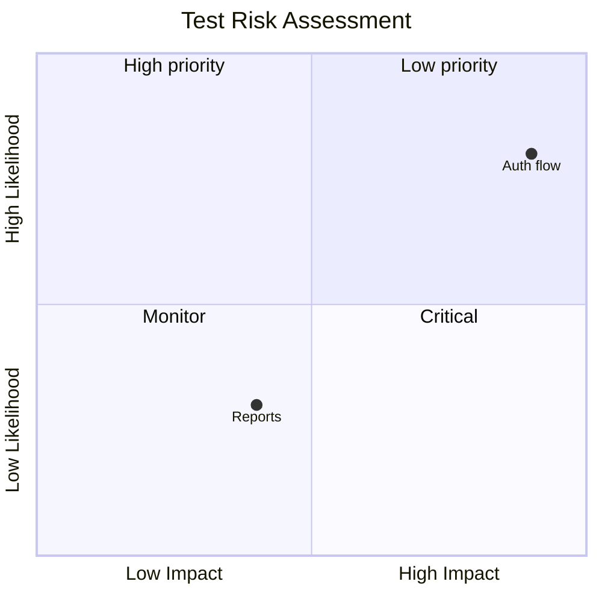

# Mermaid Pie and Quadrant Charts

## Overview
- **Pie chart:** `pie` block with `title` and `"label" : value` pairs.
- **Quadrant chart:** `quadrantChart` with `title`, `x-axis`, `y-axis`, and `quadrant` definitions.

## Pie Chart Syntax

## Quadrant Chart Syntax

## QA Examples

### Test Results

### Risk Matrix

## When to Use
- Test result distribution, coverage breakdown
- Risk prioritization, defect severity mapping
- Stakeholder reporting visuals
