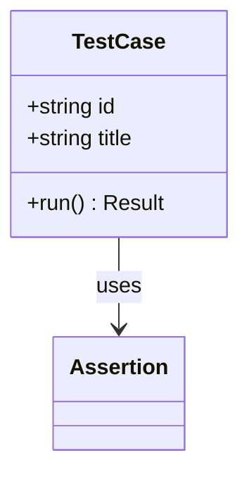
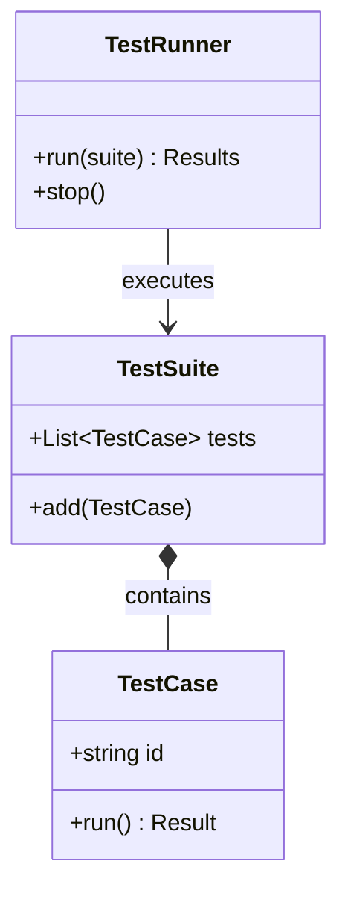
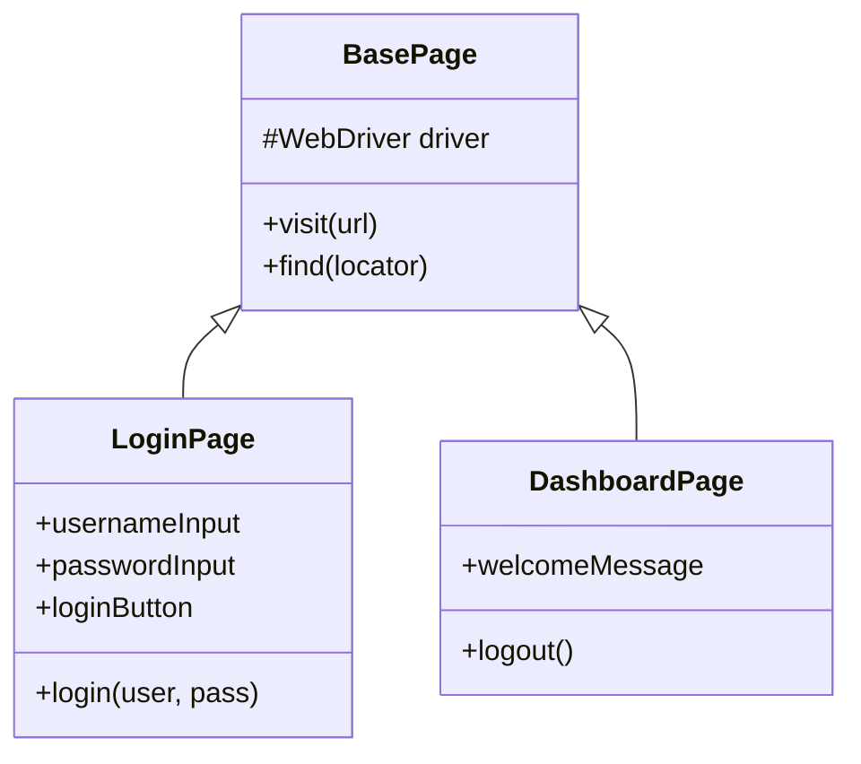
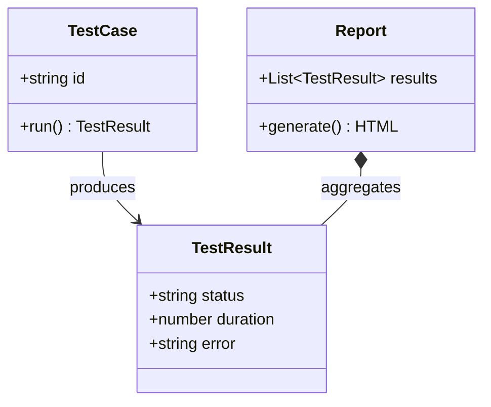

# Mermaid Class Diagram Syntax — QA Use Cases

## Syntax Overview

Class diagrams use `classDiagram`. Classes: `class ClassName { +field +method() }`. Relationships: `-->` (association), `--|>` (inheritance), `*--` (composition), `o--` (aggregation). Visibility: `+` public, `-` private, `#` protected.

## Example 1: Test Architecture

## Example 2: Page Object Model

## Example 3: Test Data Model

## When to Use

- **Test architecture:** Runner, suite, case hierarchy
- **Page Object Model:** Base page, page classes
- **Test data models:** Result, report, fixture structures
