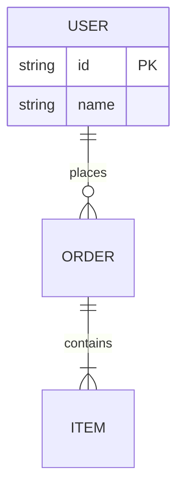
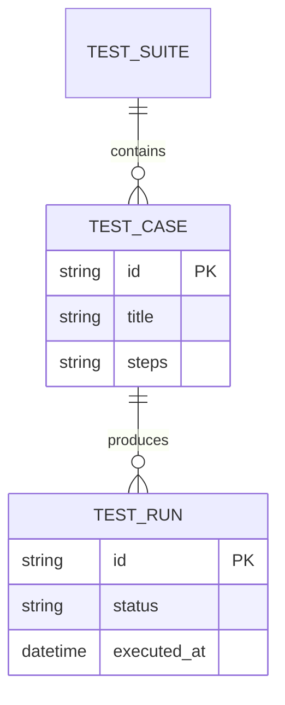
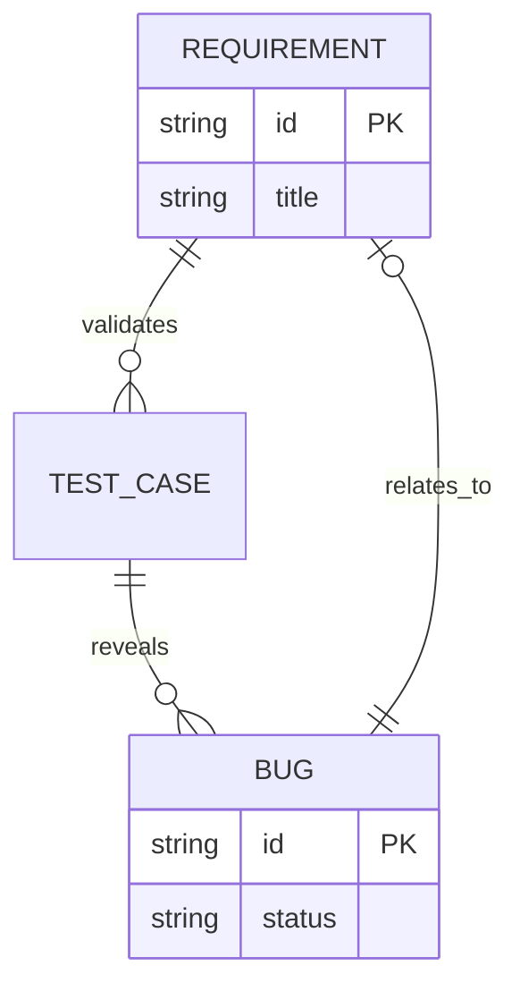
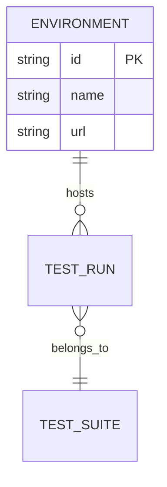

# Mermaid ER Diagram Syntax — QA Use Cases

## Syntax Overview

ER diagrams use `erDiagram`. Entities: `ENTITY { type attribute PK }`. Relationships: `ENTITY1 ||--o{ ENTITY2 : "relationship"`. Cardinality: `||--||` one-to-one, `||--o{` one-to-many, `}o--o{` many-to-many.

## Example 1: Test Data Model

## Example 2: Bug–Test Traceability

## Example 3: Test Environment Model

## When to Use

- **Test data models:** Suite, case, run relationships
- **Traceability:** Requirement ↔ Test Case ↔ Bug
- **Environment/config:** Environment, run, suite links
