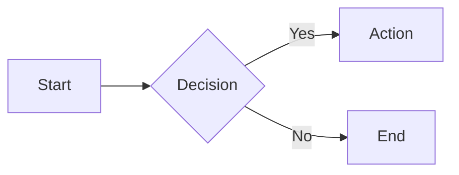
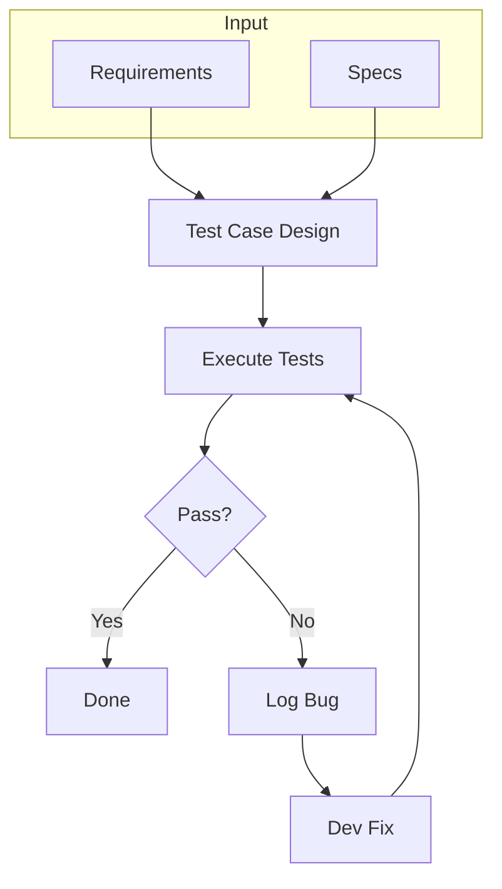
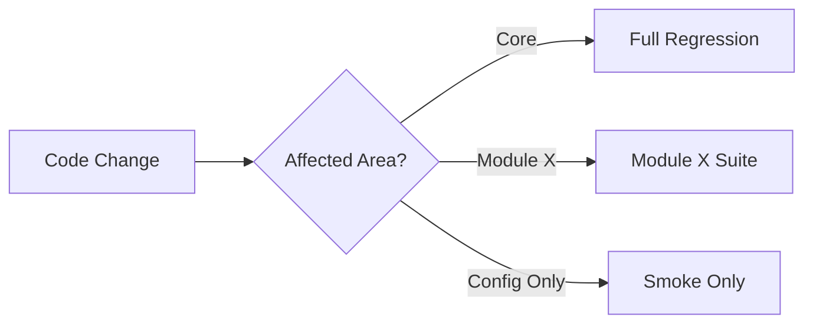
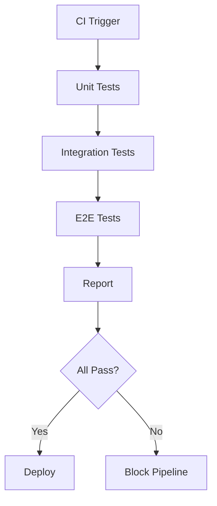
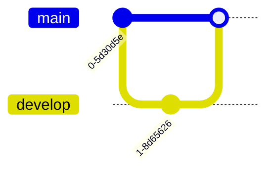

# Mermaid Flowchart Syntax — QA Use Cases

## Syntax Overview

Flowcharts use `flowchart` or `graph` keyword. Direction: `TB` (top-bottom), `LR` (left-right), `RL`, `BT`. Nodes: `[rect]`, `(rounded)`, `{diamond}`, `[(database)]`, `[[subroutine]]`. Edges: `-->`, `---`, `-.->`, `==>`.



## Example 1: Test Process Flow



## Example 2: Regression Decision Tree



## Example 3: Test Execution Flow



## Related: Git Graph, Block Diagram, BPMN

**Git Graph** — Branch strategy, release flow:


**Block Diagram** (`block-beta`) — System components:
```mermaid
block-beta
  columns 2
  block:core["API + DB"]
  block:qa["Tests"]
```

**BPMN** — Approval workflows:
```mermaid
bpmn
  task(Submit)
  task(Review)
  task(Approve)
  Submit --> Review --> Approve
```

## When to Use

- **Test process flows:** End-to-end QA workflow
- **Decision trees:** Regression scope, test selection logic
- **Pipeline flows:** CI/CD test stages, gates
- **Git Graph:** Release flow, branch strategy
- **Block Diagram:** System component layout
- **BPMN:** Approval workflows, business process testing
