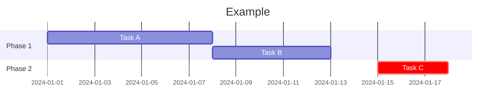
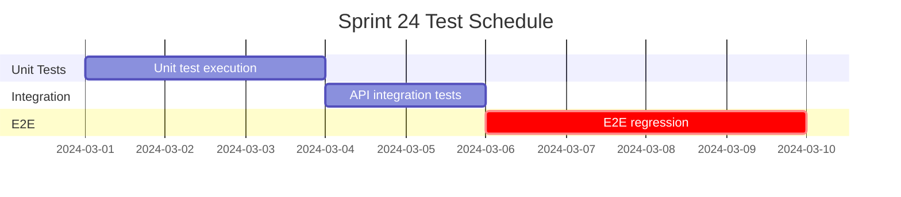
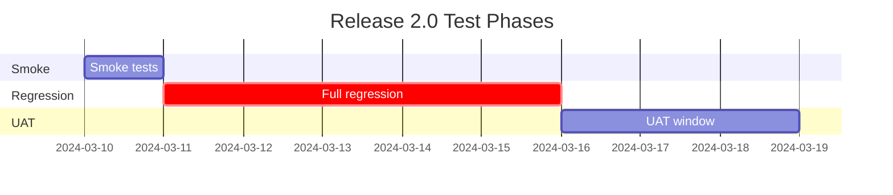

# Mermaid Gantt Chart Syntax

## Overview
Gantt charts show tasks over time. Use `gantt` block with `title`, `dateFormat`, and task definitions. Tasks use `section`, `task name :crit, id, start, end`.

## Syntax

## QA Examples

### Test Schedule

### Release Test Plan

## When to Use
- Test schedules, sprint planning, release timelines
- Phase dependencies and critical path
- Resource allocation over time
