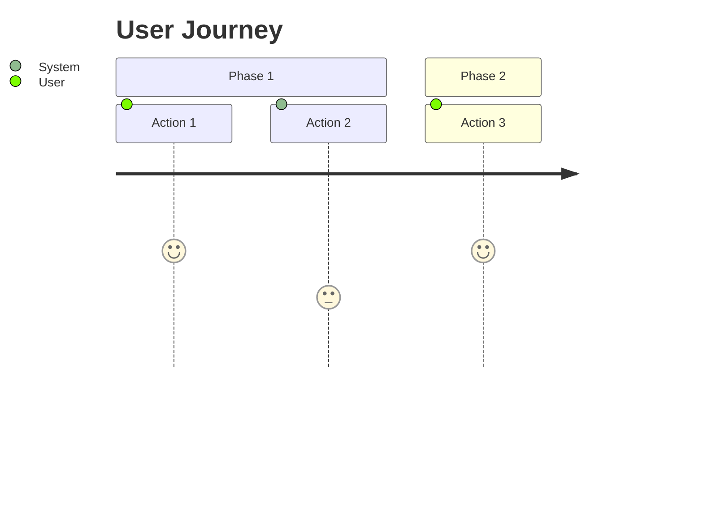
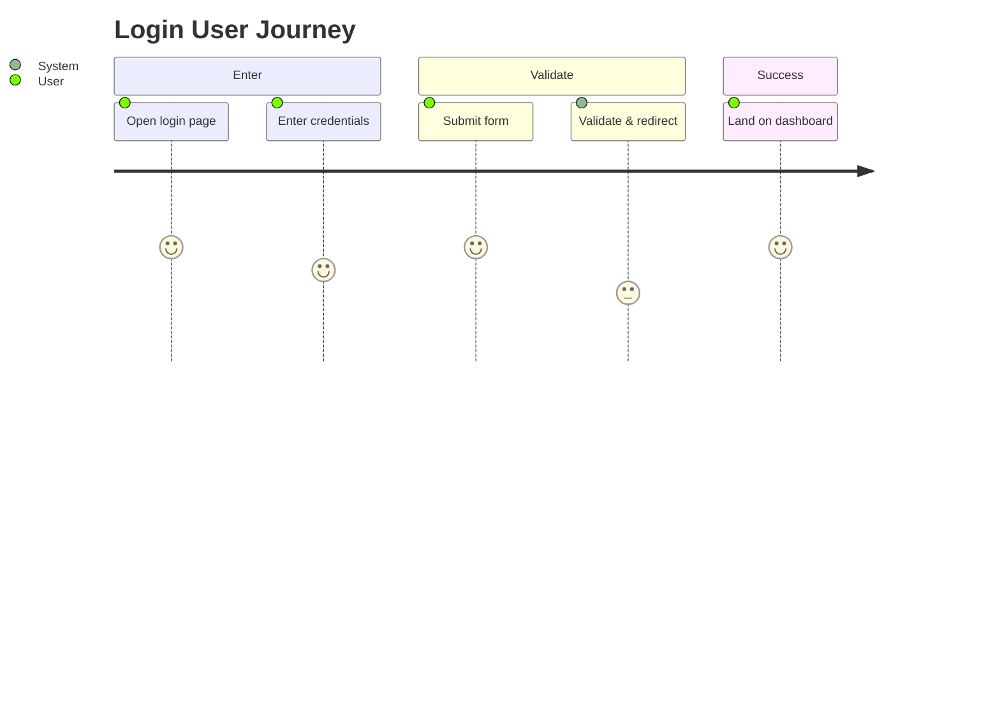
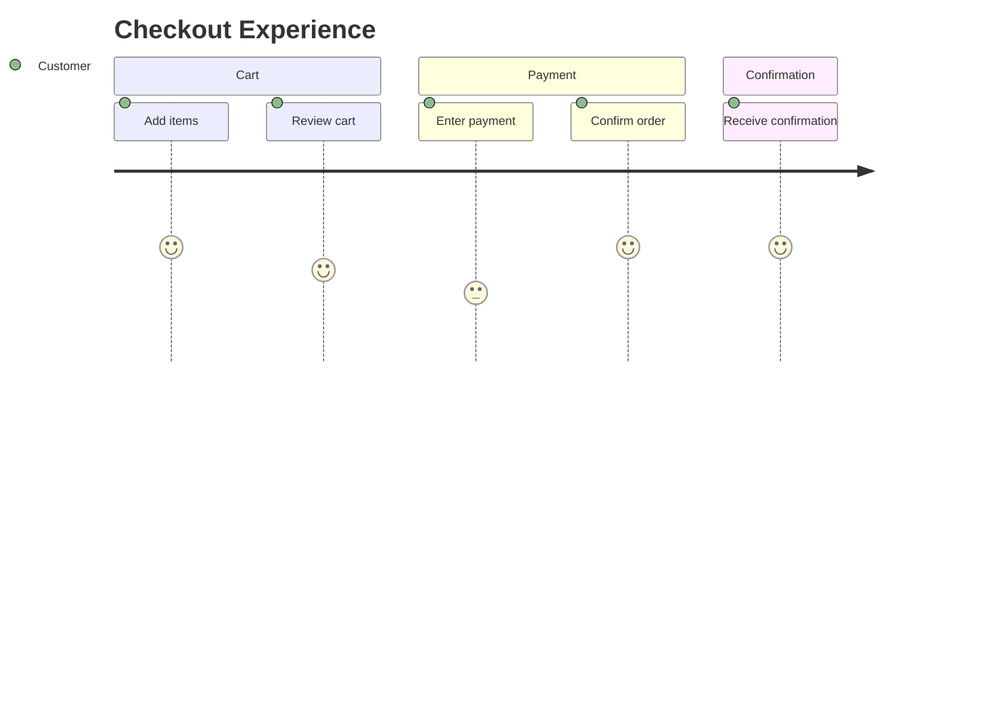

# Mermaid User Journey Syntax

## Overview
User journeys map user actions and experiences over time. Use `journey` block with `title` and `section` for phases. Tasks use `Task name: score: participant`.

## Syntax

## QA Examples

### Login Flow UX

### Checkout Flow

## When to Use
- UAT scenario design
- UX testing flows
- Identifying pain points (low scores) for test focus
