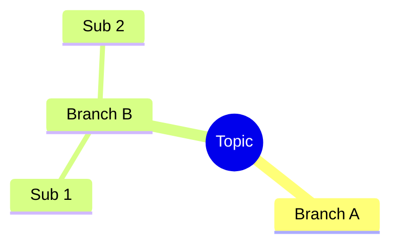
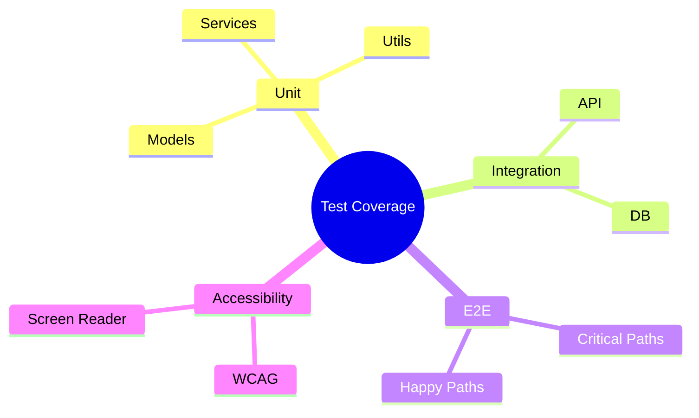
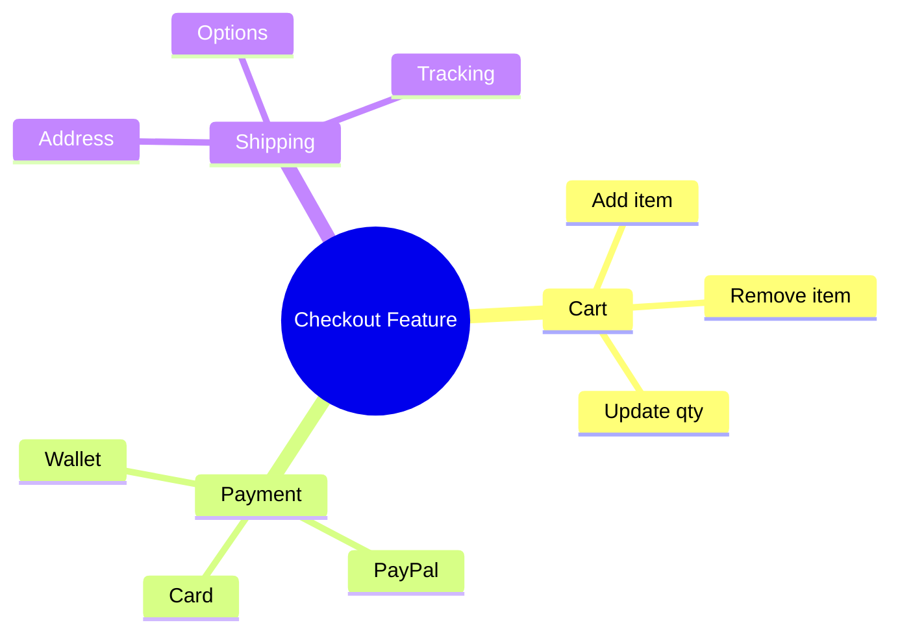
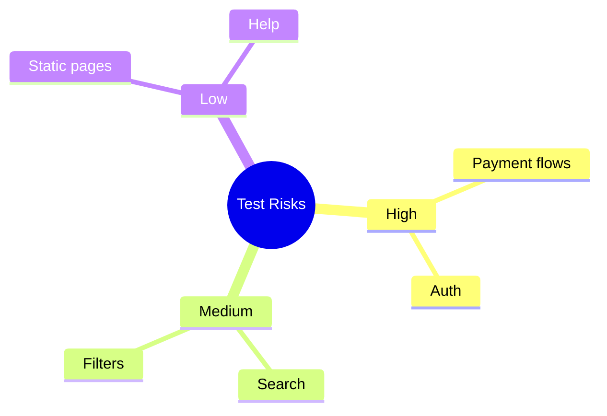

# Mermaid Mind Map Syntax — QA Use Cases

## Syntax Overview

Mind maps use `mindmap`. Root: `root((Topic))`. Children: indented with `()` for nodes. Use `:` for multiple children. Supports `[]` and `(())` for styling.

## Example 1: Test Coverage Mapping

## Example 2: Feature Decomposition

## Example 3: Risk Areas

## When to Use

- **Test coverage mapping:** Areas to cover, hierarchy
- **Feature decomposition:** Modules, sub-features
- **Risk/priority mapping:** High/medium/low areas
