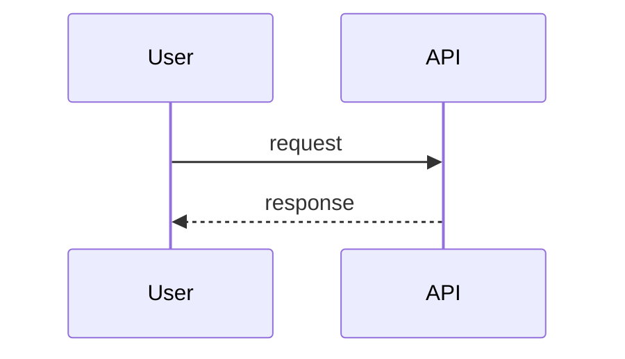
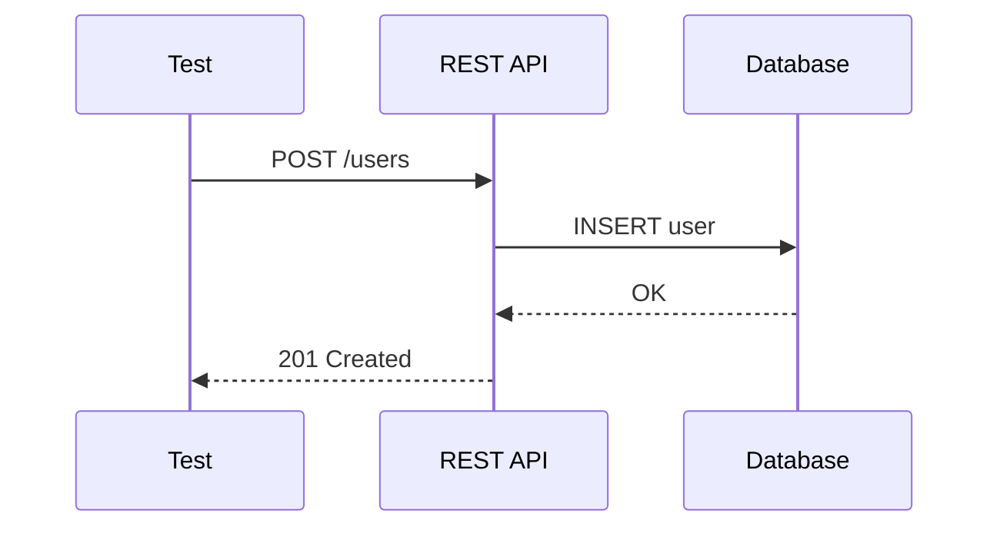
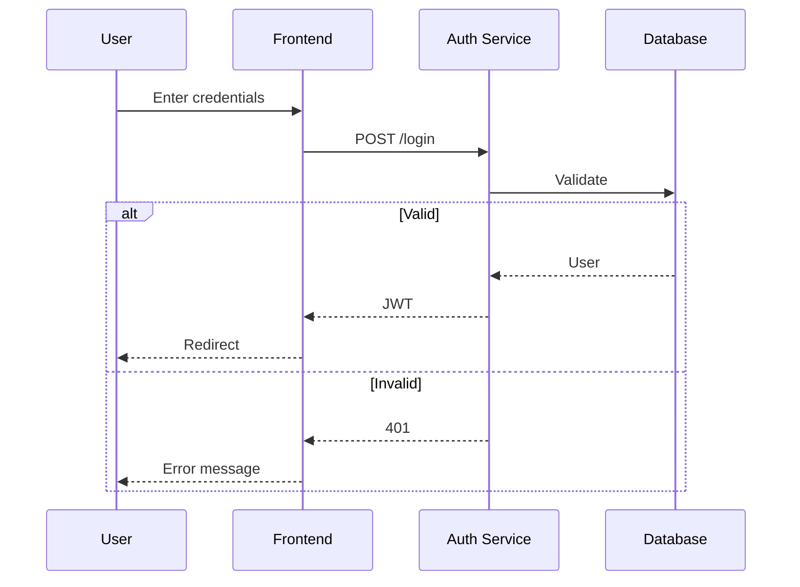
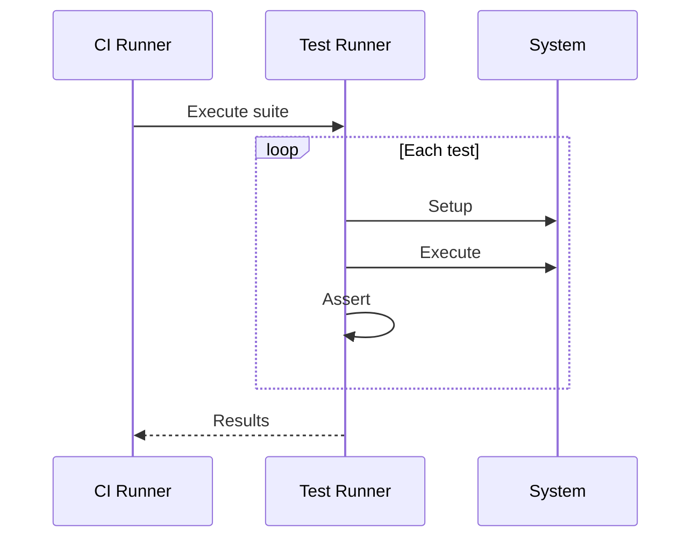

# Mermaid Sequence Diagram Syntax — QA Use Cases

## Syntax Overview

Sequence diagrams use `sequenceDiagram`. Participants: `participant A`, `actor User`. Messages: `A->>B: message`, `A-->>B: async`, `A->>+B: create`, `A->>-B: destroy`. Loops: `loop`, `alt`, `opt`, `par`.

## Example 1: API Interaction

## Example 2: Login Flow

## Example 3: Test Execution Flow

## When to Use

- **API flows:** Request/response, error paths
- **Auth flows:** Login, token refresh, logout
- **Test execution:** Setup → act → assert sequence
