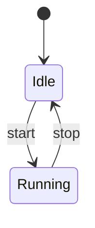
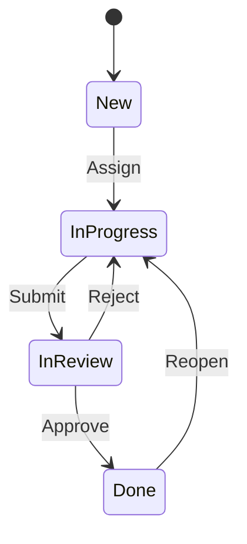
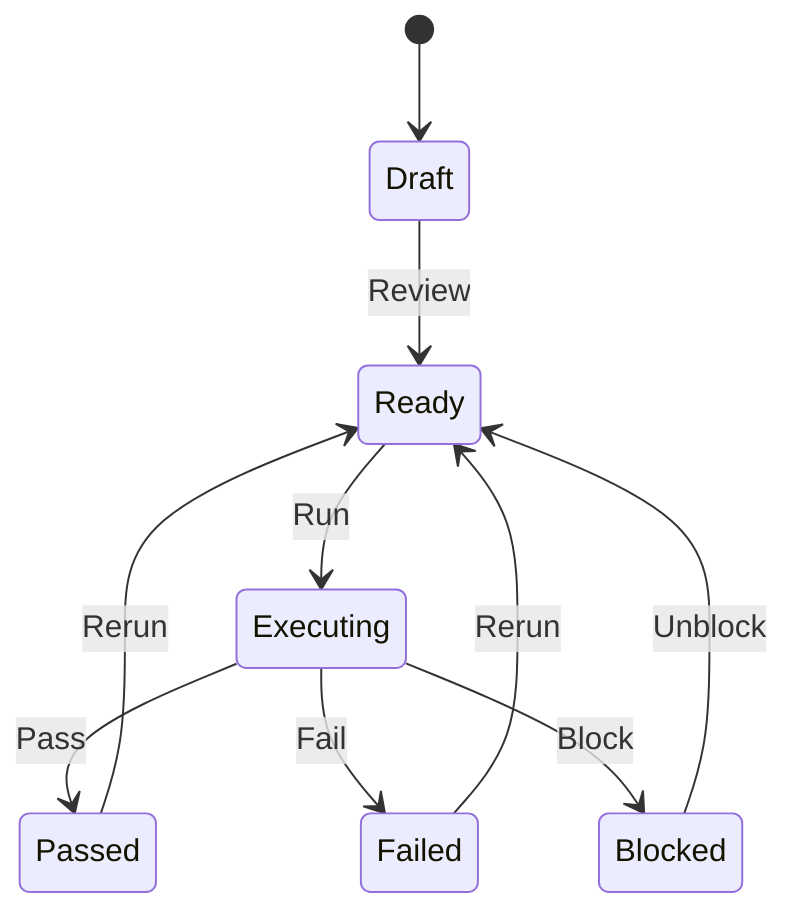
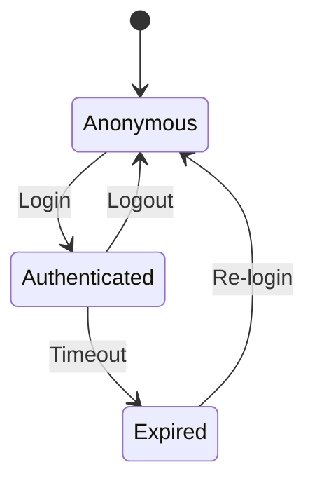

# Mermaid State Diagram Syntax — QA Use Cases

## Syntax Overview

State diagrams use `stateDiagram-v2`. States: `state "Name" as id`. Transitions: `id --> id2 : event`. Composite: `state state_name { [*] --> s1; s1 --> s2 }`. Choice: `[*] --> choice`, `choice --> s1 : cond`.

## Example 1: Bug Lifecycle

## Example 2: Test Case States

## Example 3: User Session States

## When to Use

- **Bug lifecycle:** New → In Progress → Done
- **Test case states:** Draft, Ready, Executing, Passed/Failed
- **Session/auth states:** Anonymous, Authenticated, Expired
