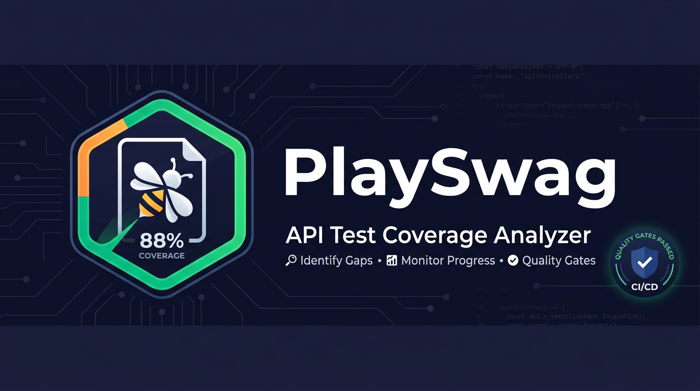

<p align="center">
  
</p>

<p align="center">
  <strong>Static API coverage analyzer for OpenAPI/Swagger specs</strong><br/>
  Scans your test files, finds coverage gaps, and generates actionable QA tasks.
</p>

<p align="center">
  
  
  
  
  
</p>

---

## What it does

PlaySwag reads your OpenAPI spec and regex-scans your test files to answer one question: **which API endpoints are tested and which are not?**

```
📊 Endpoint Coverage:  72.4%  (21/29)  ↑ +5.2%
🔢 Status Codes:       45.0%  (9/20 asserted)
📋 Parameters:         63.2%  (12/19 referenced)
✗  Uncovered:          8 endpoints
📝 QA Tasks created:   8
```

It produces an interactive HTML report, machine-readable JSON, prioritized QA tasks in Markdown, a CI-friendly JUnit XML, and an SVG badge — all from a single command with **zero runtime dependencies**.

---

## Quick Start

```bash
# JavaScript (recommended — works everywhere)
node analyze.js openapi.yaml tests/

# TypeScript
npx tsx analyze.ts openapi.yaml tests/

# Python
python3 analyze.py openapi.yaml tests/
```

Open `./playswag-report/report.html` to explore results.

---

## Features

### Coverage Dimensions

| Dimension | How it works |
|-----------|-------------|
| **Endpoint** | Regex-matched API calls in tests vs paths in spec |
| **Status code** | Scans assertions — `.expect(200)`, `toHaveStatus(404)`, `assert status_code == 422` |
| **Parameter** | Checks if spec-defined param names appear in test files |
| **By tag** | Per-tag breakdown using OpenAPI `tags` field |

### Spec Support

| Format | Features |
|--------|----------|
| Swagger 2.0 | `basePath`, `definitions`, `$ref` resolution |
| OpenAPI 3.0 / 3.1 | `servers[].url`, `components.schemas`, `$ref` resolution |
| Multi-spec | Merge endpoints from multiple files (`--` separator) |
| URL specs | Fetch from `http://` / `https://`, cached for 5 min |

### HTTP Clients Detected

Playwright `request` · axios · fetch · supertest · got · ky · httpx · requests · Cypress `cy.request` · Node.js http/https · RestAssured · aiohttp · template literal partial matching (`/api/users/${id}`)

### Output Formats

| File | Description |
|------|-------------|
| `report.html` | Interactive report — filters, search, tag bars, copy/export/print |
| `summary.json` | Machine-readable coverage with all dimensions |
| `tasks.md` | Prioritized QA automation tasks |
| `playswag-badge.svg` | Shields.io-style coverage badge |
| `playswag-junit.xml` | JUnit XML for CI pipelines |
| `playswag-history.json` | Coverage trend data (`--history`) |

---

## CLI Options

| Flag | Description |
|------|-------------|
| `--fail-under <pct>` | Exit 1 if coverage < `pct`% — CI quality gate |
| `--output <dir>` / `-o <dir>` | Output directory (default: `./playswag-report`) |
| `--format <list>` | Comma-separated: `html`, `json`, `tasks`, `badge`, `junit` |
| `--json-only` | Shorthand for `--format json` |
| `--include <patterns>` | Only analyze matching paths (wildcard `*`) |
| `--exclude <patterns>` | Skip matching paths |
| `--include-tags <tags>` | Only analyze endpoints with these tags |
| `--exclude-tags <tags>` | Skip endpoints with these tags |
| `--history` | Append to history file and show coverage delta |

---

## CI/CD Integration

### GitHub Actions

```yaml
- name: API coverage gate
  run: |
    node .cursor/skills/qa-playswag/scripts/analyze.js \
      openapi.yaml tests/ \
      --fail-under 80 \
      --format json,junit \
      --history

- name: Upload JUnit results
  if: always()
  uses: actions/upload-artifact@v4
  with:
    name: playswag-report
    path: playswag-report/
```

### Exit Codes

| Code | Meaning |
|------|---------|
| `0` | Success (coverage ≥ threshold) |
| `1` | Coverage below `--fail-under` |
| `2` | Fatal error (spec not found, parse failure) |

---

## Multi-Spec & URL

```bash
# Microservices — merge multiple specs
node analyze.js users-api.yaml orders-api.yaml -- tests/

# Remote spec
node analyze.js https://api.example.com/openapi.json tests/

# Combined
node analyze.js local.yaml https://remote/spec.json -- tests/ --fail-under 70
```

Endpoints are merged and deduplicated by `method + path`.

---

## Generated QA Task Example

```markdown
### TASK-001: Cover `POST /api/users`

| Field | Value |
|-------|-------|
| **Priority** | High |
| **Endpoint** | `POST /api/users` |
| **Auth required** | Yes |

**Acceptance Criteria:**
- [ ] Happy path → `201`
- [ ] Invalid input → 400/422
- [ ] Unauthenticated → 401
```

---

## Architecture

```
qa-playswag/
├── SKILL.md              # Agent instructions (Cursor skill)
├── README.md             # This file
├── playswag-banner.png   # Banner image
└── scripts/
    ├── analyze.js        # JavaScript — primary, zero-dep
    ├── analyze.ts        # TypeScript — feature-identical
    ├── analyze.py        # Python — feature-identical
    ├── package.json      # CommonJS override
    └── fixtures/         # Test fixtures for self-testing
```

All three analyzers share the same regex patterns, coverage logic, and output format — pick whichever runtime your project already uses.

---

## Known Limitations

- **Static analysis** — regex-based; cannot detect dynamic URL construction beyond template literal prefixes
- **Status code coverage** is assertion-based, not runtime-verified
- **Parameter coverage** uses name-matching heuristic — may count false positives
- **No auth flow verification** — `authRequired` comes from spec security definitions only
- **YAML** requires `js-yaml`/`yaml` npm package, PyYAML, or Python 3 as fallback

---

## vs [MichalFidor/playswag](https://github.com/MichalFidor/playswag) (npm)

| | npm playswag | This skill |
|---|---|---|
| **Approach** | Runtime (Playwright HTTP intercept) | Static (regex scan) |
| **Spec** | `$ref`, `servers` | Resolved `$ref`, `basePath`, multi-spec merge |
| **Languages** | TypeScript only | JS / TS / Python |
| **Output** | HTML | HTML + JSON + Markdown + SVG + JUnit XML |
| **Coverage** | Endpoint only | Endpoint + status code + parameter + by-tag |
| **CI** | — | `--fail-under`, JUnit XML, `--history` delta |

---

